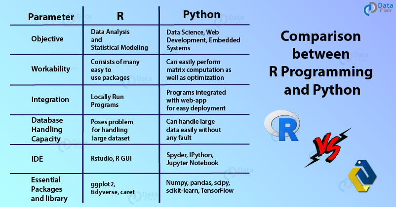

## Python and R Working Together
  R and Python are used for Data Science, but there's certainly pros and cons for both systems. For R, it doesn't require as much computer systems sophistication as Python. You can do simple data analyses in R fairly quickly. There's also a lot of packages in R that use simple universal language to explore these packages. However, Python has better software for neural nets, utilizes better scale/pipelines, is faster, and much more. 
  But do we have to pick between R and Python? The answer is no! Reticulate package allows for R and Python to work together by embedding a Python session within your R session. It's like combining two different languages in terms of data science. 
  The first thing to do is to load the reticulate package. You can pretty much assign the code anything you want. For example...
  
```{R}
#R code chunk
install.packages("reticulate",repos = "http://cran.us.r-project.org")
library(reticulate)
hi <- "I like"
```

```{python}
#Python code 

bub = "puzzles and legos"
print(r.hi, bub)

```

One of the things we've learned is Numpy, which is numerical computing in Python. It contains a multi-dimensional array and matrix data structures to perform operations on arrays. The code below shows how to use arrays with numphy. 

```{python}
import numpy as np
x=np.array([1,2,3])
x
print(x/2+1)
x.shape
mat1=np.array([[1,2],[3,4]])
mat1
iden=np.eye(2)
iden
```



